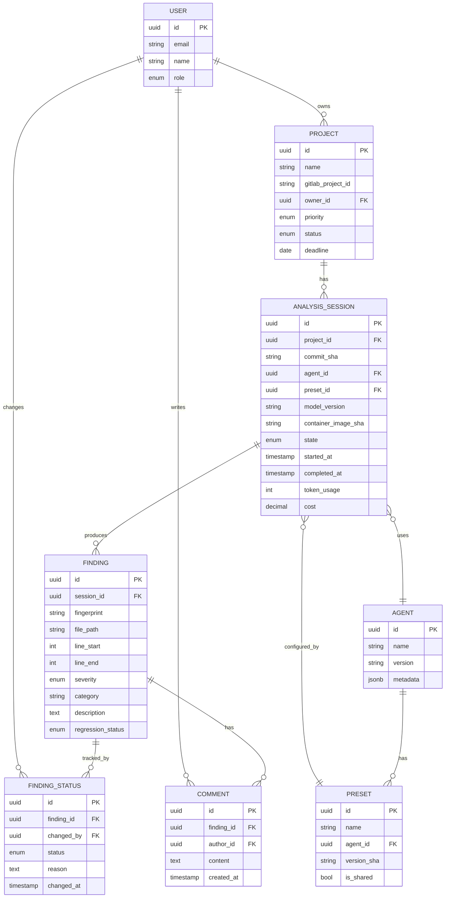

# 사내 코드 기반 정적 분석 대시보드 PRD

| 항목 | 내용 |
|---|---|
| 제품명 (가칭) | SecureScope — 사내 코드 정적 분석 대시보드 |
| 문서 버전 | v0.6 (Draft) |
| 작성일 | 2026-05-07 |
| 작성자 | (작성자) |
| 상태 | 검토 전 초안 |

---

## 1. 개요

### 1.1 배경
당사 보안 검수 프로세스는 개발 프로젝트가 일정 단계에 도달했을 때 레드팀이 투입되어 코드 정적 분석을 수행하는 방식으로 운영되고 있다. 현재는 CLI 도구 및 개별 파이프라인 위에서 수동으로 분석이 진행되고 있으며, 다음과 같은 한계가 존재한다.

- 검수자가 매번 GitLab에서 직접 대상 브랜치를 탐색·다운로드해야 함
- 정적 분석 에이전트(Claude Code, Codex 등) 실행이 개인 로컬 환경에 의존적이어서 환경 편차·재현성 이슈가 발생
- 검수 이력이 체계적으로 축적되지 않아 회귀 추적, 통계 산출, 인수인계가 어려움
- 공수 산정 → 분석 → 검증 단계가 도구별로 흩어져 있어 협업·관리 비용이 큼

### 1.2 목적
기획서 검토와 공수 산정부터 코드 적재, 정적 분석, 결과 검증, 이력 관리에 이르는 **보안 검수의 전 과정을 단일 웹 대시보드에서 수행**할 수 있도록 한다.

### 1.3 비전
> "레드팀 검수자가 클릭 몇 번으로 분석을 시작하고, 모든 활동이 자동으로 이력화되는 보안 검수 환경"

---

## 2. 현재 프로세스 (As-Is)

| # | 단계 | 도구 | 주요 페인포인트 |
|---|---|---|---|
| 1 | 기획서 검토 → 공수 산정 | 수동 / 스프레드시트 | 산정 기준 부재, 과거 데이터 미축적 |
| 2 | GitLab에서 대상 브랜치 식별·다운로드 | git CLI | 대상 식별 오류, 작업 중복, 환경 격리 미흡 |
| 3 | 정적 분석 에이전트 실행 | Claude Code, Codex 등 CLI | 개인 환경 의존, 재실행·재현 어려움 |
| 4 | 분석 결과 검증 | 수동 / 메모 | 검증 워크플로우 표준화 미비, 이력 누락 |

---

## 3. 목표 프로세스 (To-Be)

웹 대시보드 단일 진입점에서 다음을 수행한다.

1. **프로젝트 등록** → 기획서 업로드 → 공수 산정 보조
2. **GitLab 연동** → 브랜치 자동 식별 및 격리 환경에 코드 적재
3. **분석 실행** → 에이전트(Claude Code, Codex 등) 선택 후 실행 및 모니터링
4. **결과 검증** → 취약점 인라인 검토, 오탐/확정 분류, 코멘트 부여
5. **이력 관리** → 모든 단계가 프로젝트별 이력으로 자동 저장 및 회귀 추적

---

## 4. 타겟 사용자

| 페르소나 | 역할 | 주요 니즈 |
|---|---|---|
| 레드팀 검수자 (Primary) | 정적 분석 수행 및 결과 검증 | 빠른 분석 시작, 일관된 분석 환경 |
| 레드팀 리드 | 공수 배정, 진행 모니터링 | 작업 가시성, 통계, 리포트 |
| 개발팀 (Secondary) | 검수 결과 수신·조치 | 명확한 취약점 정보, 커뮤니케이션 채널 |
| 보안 책임자 | 보안 KPI 추적 | 트렌드, 감사 로그, 정책 준수 확인 |

---

## 5. 범위

### 5.1 In-Scope (MVP)
- 프로젝트 CRUD 및 상태 관리
- 기획서 업로드·메타데이터 관리
- GitLab 연동 (브랜치/태그/커밋 단위 코드 적재)
- Claude Code, Codex 기반 정적 분석 실행
- 분석 결과 뷰 및 검증 워크플로우
- 검수 이력 저장 및 조회
- 사용자 인증, 역할 기반 접근 제어(RBAC)

### 5.2 Out-of-Scope (향후 검토)
- 동적 분석(DAST), 인프라/네트워크 보안 검수
- 비-GitLab 저장소(GitHub Enterprise 등) 연동
- 자동 PR 작성, 자동 패치 제안
- AI 기반 위협 모델링·아키텍처 리뷰

---

## 6. 기능 요구사항

### F1. 프로젝트 관리
- **F1-1** 프로젝트 등록(이름, 담당자, 우선순위, 마감일, 보안 등급)
- **F1-2** 기획서 업로드(.pdf, .docx, .md 등) 및 미리보기
- **F1-3** 공수 산정 보조: LOC·복잡도·과거 이력 기반 추정 + 수동 조정
- **F1-4** 상태 전이: `대기 → 분석중 → 검증중 → 완료 / 보류`

### F2. GitLab 연동
- **F2-1** 사내 GitLab 인증 (PAT 또는 OAuth)
- **F2-2** 프로젝트·브랜치·태그 검색 및 선택
- **F2-3** 특정 커밋 또는 diff 범위(시작~종료 커밋) 지정
- **F2-4** 격리된 분석 환경(컨테이너)에 코드 적재 및 분석 종료 시 자동 정리

### F3. 정적 분석 실행
- **F3-1** 분석 에이전트 선택: Claude Code, Codex (이후 플러그인 형태로 확장)
- **F3-2** 분석 프리셋 관리: 룰셋, 프롬프트, 분석 스코프
- **F3-3** 비동기 작업 큐 + 실시간 로그 스트리밍
- **F3-4** 실패/타임아웃 시 재시도, 부분 재분석 지원
- → 상세 정의: **부록 A**

### F4. 결과 뷰 및 검증
- **F4-1** 취약점 리스트 (심각도, 카테고리, 파일 경로, 라인 번호, 설명)
- **F4-2** 인라인 코드 뷰어 + 취약점 위치 하이라이트
- **F4-3** 검증 액션: `확정` / `오탐(false positive)` / `추가 확인 필요`
- **F4-4** 코멘트, 태그, 외부 링크 첨부

### F5. 이력 관리
- **F5-1** 프로젝트별 분석 회차 이력 (커밋 SHA, 룰셋, 에이전트, 결과)
- **F5-2** 회차 간 동일 취약점 자동 매칭 및 회귀(regression) 추적
- **F5-3** 리포트 내보내기 (CSV / PDF / Markdown)
- **F5-4** 검색·필터: 기간, 담당자, 심각도, 상태, 카테고리
- → 상세 정의: **부록 B**

### F6. 대시보드
- **F6-1** 팀/개인 작업 현황 보드
- **F6-2** 심각도·카테고리별 취약점 트렌드
- **F6-3** 평균 검수 소요시간, SLA 준수율

### F7. 인증·권한·감사
- **F7-1** 사내 SSO 연동
- **F7-2** 역할: `Admin` / `Lead` / `Reviewer` / `Viewer`
- **F7-3** 감사 로그: 분석 실행, 결과 변경, 코드 다운로드, 권한 변경 등

---

## 7. 비기능 요구사항

### 7.1 보안
- 분석 대상 코드는 격리된 환경에서만 처리, 분석 완료 후 정의된 보존 기간 경과 시 자동 삭제
- 모든 통신 TLS 적용, 저장 데이터 암호화(at rest)
- 외부 LLM 호출 시 사내 데이터 전송 정책 준수 (정책 확정 필요 — §10 참고)

### 7.2 성능
- 표준 분석 작업: 100만 LOC 기준 30분 이내 완료(에이전트 처리 시간에 의존)
- 대시보드 주요 화면 로드 P95 < 2초

### 7.3 확장성
- 분석 에이전트는 플러그인 구조로 추가 가능
- 동시 분석 작업 N개 이상 (구체 수치는 인프라 검토 후 확정)

### 7.4 가용성
- 업무 시간 기준 가용성 99% 이상

---

## 8. 사용자 시나리오 (예시)

**시나리오 A: 신규 검수 시작부터 결과 공유까지**
1. 레드팀 검수자가 SSO로 대시보드에 로그인
2. **신규 프로젝트** 등록 → 기획서 업로드 → 시스템이 자동 추천한 공수 `1.5d` 확인 후 확정
3. GitLab 연동 화면에서 `service-x / release-1.4` 브랜치 선택
4. **Claude Code 기반 표준 보안 검수** 프리셋 선택 후 분석 실행
5. 12분 후 분석 완료, 17건의 취약점 도출
6. 인라인 코드 뷰에서 5건 `오탐` 처리, 3건 `추가 확인 필요`, 9건 `확정`
7. 최종 리포트를 PDF로 내보내 개발팀에 공유, 프로젝트 상태 `완료`로 전환
8. 모든 활동이 프로젝트 이력 페이지에 자동 기록

---

## 9. 성공 지표 (KPI)

- 검수 1건당 평균 소요 시간 **30% 단축**
- 검수 이력 시스템 내 보존율 **100%**
- 분기별 오탐 비율 가시화 및 감소 추세 확보
- 검수자 만족도(NPS) **≥ 40**
- 회귀 취약점 발견 건수 — 분기 추이 추적

---

## 10. 가정 및 리스크

### 확정 사항 (2026-05-07 업데이트)

- ✅ **사내 GitLab API 풀 권한 확보** — F2 (GitLab 연동) 진행 가능
- ✅ **Claude Code, Codex 사용 가능 확정** — F3 에이전트 통합 진행 가능
- ✅ **외부 LLM (OpenAI API) 사용 정책 승인** — 격리 Pod에서 외부 호출 허용

### 잔여 리스크

| 리스크 | 영향 | 대응 방안 |
|---|---|---|
| LLM 호출 비용 통제 어려움 | 운영비 증가 | 토큰 사용량 모니터링, 프로젝트별 한도 (부록 I) |
| 모델 버전 변경에 따른 결과 변동 | 재현성 저하 | 회차별 모델 버전 메타데이터 저장 (부록 A) |
| 격리 환경 운영 비용 | 인프라 부담 | 컨테이너 기반 단기 자원, 자동 회수 (부록 C) |
| 프로젝트별 외부 LLM 적용 가능 여부 | 일부 민감 프로젝트 적용 불가 가능성 | 프로젝트 등록 시 데이터 등급 필드, 사내 모델 fallback 옵션 검토 |

---

## 11. 마일스톤 (제안)

| 단계 | 주요 산출물 | 기간(예상) |
|---|---|---|
| M1. Discovery | 사용자 인터뷰, 워크플로 확정, 기술 스택 결정 | 2주 |
| M2. MVP | F1, F2, F3(기본), F4, F5(기본), F7 | 6–8주 |
| M3. Beta | F6 대시보드, 리포트 내보내기, 회귀 추적 | 4주 |
| M4. GA | 안정화, RBAC 고도화, 감사 로그 완성 | 4주 |

---

## 12. 추가 논의 필요 사항

- 분석 결과 및 코드의 보존 기간 정책 (법무·보안 협의)
- 외부 LLM 사용 범위 — 사내 모델 우선 / 병행 / 대체
- 개발팀과의 인터페이스 — 조치 트래킹까지 포함할지 여부
- 비-GitLab 저장소(GitHub Enterprise 등) 지원 우선순위
- 분석 에이전트 플러그인 인터페이스 표준 정의 시점

---

# 부록 A. F3 분석 실행 — 상세 정의

## A.1 분석 작업(Analysis Job) 라이프사이클

분석 작업은 다음 상태를 거치며, 각 전이는 이벤트로 발행되어 프론트엔드에 SSE/WebSocket으로 전달된다.

| 상태 | 설명 | 평균 소요 |
|---|---|---|
| `QUEUED` | 사용자 실행 요청 후 대기열 진입 | — |
| `PREPARING` | 격리 환경 프로비저닝, 코드 클론, 의존성 준비 | 30s ~ 2m |
| `RUNNING` | 에이전트 실행, 토큰·로그 스트리밍 | 작업별 상이 |
| `POST_PROCESSING` | 결과 정규화, finding 핑거프린트 산출, 회귀 매칭 | 10s ~ 1m |
| `COMPLETED` / `FAILED` / `CANCELED` | 종결 상태 | — |

각 회차에는 다음 메타데이터가 immutable하게 저장된다: 요청자, 시작·종료 시각, 사용 에이전트·버전, 모델 버전, 토큰 사용량, 비용, 컨테이너 이미지 SHA.

## A.2 에이전트 플러그인 인터페이스

신규 에이전트를 추가할 때 구현해야 하는 표준 인터페이스(개념 정의):

| 메서드 | 설명 |
|---|---|
| `describe()` | 메타데이터 (지원 언어, 최대 입력 크기, 비용 프로파일) |
| `prepare(context)` | 격리 환경에서 실행 전 준비 |
| `analyze(context)` | 본 분석 수행, 진행률·로그 스트리밍 |
| `parse_results(raw)` | 표준화된 finding 객체로 변환 |
| `terminate()` | 정상/비정상 종료 시 정리 |

에이전트 메타데이터는 DB 레지스트리에 저장되어 UI에서 동적으로 선택 가능하다.

## A.3 프리셋(Preset) 관리

프리셋은 `(에이전트, 프롬프트 템플릿, 룰셋, 스코프 규칙, 타임아웃, 재시도)`의 조합이다.

- **빌트인 프리셋**: "표준 보안 검수", "Quick Diff Scan", "PII 집중 점검" 등
- **공유 프리셋**: 팀/조직 단위로 공유, RBAC 적용
- **개인 프리셋**: 검수자 개인 커스텀
- **버전 관리**: 프리셋 수정 시 새 버전 SHA 생성, 회차 메타데이터에 사용된 버전이 기록되어 재현성 보장

## A.4 재현성(Reproducibility)

각 분석 회차는 다음을 핀(pin)하여 저장한다.

- GitLab 커밋 SHA, diff 범위
- 에이전트 버전, 모델 버전(예: `claude-opus-4-7`)
- 프리셋 버전 SHA, 룰셋 버전 SHA
- 실행 환경 컨테이너 이미지 SHA

→ "동일 설정으로 재실행" 기능, 두 회차 간 결과 diff 뷰 제공.

## A.5 리소스·비용 관리

- 작업 큐 우선순위: `URGENT` / `NORMAL` / `BACKGROUND`
- 사용자/프로젝트별 동시 실행 제한
- 분석당 한도: 최대 실행 시간, 최대 토큰, 최대 비용 (위반 시 자동 중단)
- 토큰 사용량·LLM 호출 비용 회차별 기록 → 월별 코스트 리포트 자동 산출

## A.6 실패 처리 매트릭스

| 실패 유형 | 자동 처리 | 사용자 액션 |
|---|---|---|
| 코드 클론 실패 | 즉시 실패 처리 | GitLab 자격증명/브랜치 확인 |
| 에이전트 일시 오류 | 지수 백오프 자동 재시도(최대 N회) | 로그 확인 후 수동 재실행 |
| LLM API 타임아웃 | 부분 결과 보존 후 재시도 | 분석 스코프 축소 가능 |
| 한도 초과 | 즉시 중단 | 한도 조정 요청 또는 스코프 축소 |

---

# 부록 B. F5 이력 관리 — 상세 정의

## B.1 데이터 계층 구조

```
Project
└── Analysis Session (회차)
    ├── Metadata (커밋, 에이전트, 프리셋, 모델 버전)
    ├── Logs (실행 로그)
    └── Findings (취약점)
        ├── Status History
        ├── Comments
        └── Source Code Reference
```

각 회차는 immutable이며, 검증 상태(확정/오탐/추가확인)만 추후 갱신 가능하다. 갱신 이력은 별도 테이블에 append-only로 기록된다.

## B.2 회귀 추적(Regression Tracking)

- **Finding Fingerprint**: `hash(file_path + 정규화된_코드_스니펫 + vulnerability_type)`
- 회차 간 핑거프린트 매칭으로 동일 취약점 식별
- 상태 라벨:

| 라벨 | 의미 |
|---|---|
| `NEW` | 직전 회차 대비 신규 발견 |
| `RECURRING` | 이전 회차에서도 발견됨 |
| `RESOLVED` | 이전 회차에서 발견되었으나 이번 회차에 사라짐 |
| `CARRIED_OVER` | 미해결 상태로 이어짐 |

핑거프린트 매칭 정확도 향상을 위해 코드 정규화(공백·주석 제거, AST 기반 등) 옵션을 룰셋 차원에서 설정 가능. 매칭 누락(false negative) 시 수동 병합 지원.

## B.3 리포트(Reports)

| 템플릿 | 대상 | 주요 내용 |
|---|---|---|
| Executive Summary | 보안 책임자 | 심각도 통계, 트렌드, 핵심 리스크 |
| Technical Report | 개발팀 | 취약점 상세, 코드 위치, 권장 조치 |
| Compliance Report | 감사 | 검수 이력, 처리 결과, 감사 로그 |

- **포맷**: PDF / Markdown / CSV(취약점 표) / JSON(machine-readable)
- **커스터마이징**: 섹션 선택, 민감 정보 마스킹
- **자동 생성**: 회차 완료 시 기본 템플릿 자동 생성 옵션

## B.4 검색·필터

- 풀텍스트 검색: 취약점 설명, 코멘트, 코드 스니펫
- 패싯 필터: 기간, 심각도, 카테고리, 상태, 검수자, 프로젝트, 에이전트
- 저장된 필터 뷰 (개인/공유)
- API 제공: 외부 시스템 연동용

## B.5 보존·감사

- 보존 정책: 프로젝트 종료 후 N개월간 보존, 이후 익명화 또는 삭제 (정책 확정 필요)
- 감사 로그: 회차 생성, 상태 변경, 리포트 다운로드, 권한 변경 등 immutable 기록
- 데이터 export: 외부 감사 대응용 전체 이력 내보내기

---

# 부록 C. 기술 스택 검토

## C.1 전체 아키텍처 (개요)

자세한 시스템 아키텍처는 별도 다이어그램을 참조하되, 구성 요소를 요약하면 다음과 같다.

- 사용자 → 프론트엔드(Next.js) → API 게이트웨이/SSO → 백엔드(FastAPI)
- 백엔드 ↔ PostgreSQL / Redis / S3 호환 스토리지
- 백엔드 → 워크플로우 엔진(Temporal) → K8s Job 격리 실행 환경
- 격리 Pod → GitLab API, LLM API(Claude / Codex)
- 전 레이어에 걸쳐 SSO·Vault·관찰성(Observability) 스택 적용

## C.2 프론트엔드

| 항목 | 선택 | 사유 |
|---|---|---|
| 언어 | TypeScript | 타입 안정성, 대시보드 규모 적합 |
| 프레임워크 | Next.js (App Router) | SSR, 라우팅, RSC 활용 |
| 스타일 | TailwindCSS + shadcn/ui | 빠른 UI 구축, 일관성 |
| 데이터 페칭 | TanStack Query | 캐시·재시도·낙관적 업데이트 |
| 코드 뷰어 | Monaco Editor | 인라인 코드 하이라이트, 친숙한 UX |
| 실시간 통신 | SSE / WebSocket | 분석 로그 스트리밍 |

## C.3 백엔드

| 항목 | 선택 | 사유 |
|---|---|---|
| 언어 | Python 3.12+ | LLM 생태계 호환, 에이전트 통합 용이 |
| 프레임워크 | FastAPI | 비동기, OpenAPI 자동 생성, 가벼움 |
| ORM | SQLAlchemy + Alembic | 마이그레이션 관리 |
| 인증 라이브러리 | Authlib (OIDC/SAML) | 사내 SSO 연동 |
| 검증 | Pydantic v2 | 강타입 입력 검증 |

> Java/Kotlin(Spring) 또는 Node.js(NestJS)도 후보. 팀 역량 및 LLM SDK 활용도를 고려해 Python 권장.

## C.4 데이터 저장소

| 용도 | 선택 | 비고 |
|---|---|---|
| 메인 DB | PostgreSQL 16 | 메타데이터, 사용자, 회차, 상태 |
| 캐시·세션·큐 브로커 | Redis | 세션 + 단순 큐 |
| 객체 저장소 | S3 호환(MinIO 등) | 코드 스냅샷, 리포트, 첨부 |
| 검색(풀텍스트) | PostgreSQL FTS → 규모 시 OpenSearch | 단계적 도입 |

## C.5 작업 큐 / 워크플로우

| 옵션 | 특징 | 권장 시나리오 |
|---|---|---|
| Celery + Redis | 단순, 친숙 | 단일 단계 작업 위주 |
| **Temporal** (권장) | 워크플로우 오케스트레이션, 재시도/타임아웃/상태 내장 | 분석 라이프사이클 다단계·장시간 |
| RQ | 매우 단순 | 소규모 |

→ 분석 작업이 다단계(준비 → 실행 → 후처리)이고 재시도·재현이 중요하므로 **Temporal** 권장. Celery로 시작 후 Temporal로 마이그레이션하는 점진적 전략도 가능.

## C.6 격리 실행 환경

| 항목 | 선택 |
|---|---|
| 실행 격리 | Kubernetes Job (분석 1건 = 1 Pod) |
| 네트워크 통제 | NetworkPolicy로 외부 egress를 GitLab + LLM 엔드포인트로 제한 |
| 임시 스토리지 | `emptyDir` 또는 ephemeral PVC, 종료 시 자동 삭제 |
| 시크릿 관리 | HashiCorp Vault + K8s Secrets (런타임 주입) |
| 컨테이너 이미지 | 검증된 베이스 + 에이전트별 사이드카, 이미지 SHA 회차 메타에 기록 |

→ 격리 보장, 자동 정리, 동시 실행 스케일링이 자연스러움. 강한 격리가 추가로 필요하면 Firecracker microVM(KubeVirt 등) 도입 검토.

## C.7 인증·권한

- **SSO**: SAML 2.0 또는 OIDC (사내 IdP 연동)
- **세션**: 짧은 TTL의 JWT + refresh token (HttpOnly Cookie)
- **API 인증**: 서비스 토큰 + scope 기반 권한
- **외부 자격증명**(GitLab PAT, LLM API Key): Vault에 보관, 런타임에만 주입
- **RBAC**: `Admin` / `Lead` / `Reviewer` / `Viewer` × 프로젝트 단위 권한 매트릭스
- **감사**: 권한 변경, 자격증명 발급/폐기, 다운로드 이벤트 모두 immutable 로그

## C.8 관찰성(Observability)

| 영역 | 도구 |
|---|---|
| 메트릭 | Prometheus + Grafana |
| 로그 | Loki 또는 ELK |
| 트레이스 | OpenTelemetry → Jaeger / Tempo |
| 알람 | Alertmanager → Slack / Email |

분석 작업 단위로 traceId를 발행하여 프론트 → 백엔드 → Temporal → K8s Job → LLM 호출까지 단일 추적 가능하게 구성한다.

## C.9 배포·운영

- 컨테이너 오케스트레이션: Kubernetes (사내 또는 매니지드)
- CI/CD: GitLab CI (사내 GitLab 자체 활용)
- 인프라 코드: Terraform + Helm
- 환경 분리: `dev` / `stage` / `prod`
- 비밀 관리: Vault, ExternalSecrets Operator

## C.10 핵심 기술 의사결정 포인트

| 포인트 | 옵션 | 결정 기준 |
|---|---|---|
| 워크플로우 엔진 | Celery vs Temporal | 분석 단계 복잡도, 운영 부담 |
| 백엔드 언어 | Python vs JVM vs Node | 팀 역량, LLM 생태계 |
| 격리 단위 | K8s Job vs Firecracker microVM | 보안 수준 요구치 |
| 외부 LLM 사용 | 외부 API vs 사내 자가호스팅 | 데이터 정책, 비용 |
| 검색 엔진 | PG FTS vs OpenSearch | 데이터 규모, 검색 요구사항 |

---

---

# 부록 D. 분석 결과 검증 화면

## D.1 화면 구조

회차 상세 페이지의 핵심 작업 화면. 검수자가 코드와 취약점을 동시에 보면서 검증을 수행한다.

### 레이아웃 (좌우 분할, 데스크탑 기준)

| 영역 | 비율 | 내용 |
|---|---|---|
| 헤더 | 100% | 브레드크럼 / 회차 번호·검출 건수 / 에이전트·커밋·시각 / 리포트 내보내기 |
| 좌: 코드 뷰어 | ~58% | 파일 경로 헤더, 줄 번호 + 코드 본문, 취약 라인 하이라이트 + 좌측 마커 |
| 우: 취약점 패널 | ~42% | 필터 바, 선택된 취약점 상세, 나머지 취약점 컴팩트 리스트 |

## D.2 인터랙션

- 우측 패널의 취약점 클릭 → 좌측 코드 뷰어가 해당 라인으로 자동 스크롤·하이라이트
- 좌측 코드의 하이라이트 라인 클릭 → 우측 패널의 해당 취약점이 확장 표시
- 검증 액션 버튼(`확정` / `오탐` / `검토 필요`) 클릭 → 상태 즉시 저장, 변경 이력은 `FindingStatus`에 append-only로 기록
- 상단 필터: 심각도 / 카테고리 / 검증 상태 / 회귀 라벨로 사이드 패널 필터링
- 다수 검수자 동시 작업 시 WebSocket으로 상태 동기화, 충돌 시 마지막 변경자 표기

## D.3 단축키 (제안)

| 키 | 동작 |
|---|---|
| `j` / `k` | 다음 / 이전 취약점 |
| `c` | 확정 (Confirm) |
| `f` | 오탐 (False positive) |
| `r` | 검토 필요 (Review) |
| `e` | 코멘트 작성 |
| `/` | 검색 |

## D.4 컴포넌트 책임

| 컴포넌트 | 기술 | 비고 |
|---|---|---|
| 코드 뷰어 | Monaco Editor (read-only) | 라인 하이라이트, 미니맵, 검색 |
| 사이드 패널 | React + TanStack Query | 검증 상태 낙관적 업데이트 |
| 상태 동기화 | WebSocket (FastAPI) | 다수 사용자 동시 편집 충돌 표시 |

---

# 부록 E. 데이터 모델

## E.1 핵심 엔티티

| 엔티티 | 역할 |
|---|---|
| `User` | 시스템 사용자 (검수자, 리드, 개발자, 관리자) |
| `Project` | 보안 검수 단위. GitLab 프로젝트와 1:1 또는 1:N 매핑 |
| `AnalysisSession` | 분석 회차. 한 번의 분석 실행 = 하나의 세션 |
| `Finding` | 분석 결과 도출된 개별 취약점 |
| `FindingStatus` | 검증 상태 변경 이력 (append-only, 감사 용도) |
| `Comment` | 취약점에 대한 검수자 코멘트 |
| `Agent` | 분석 에이전트 메타데이터 (Claude Code, Codex 등) |
| `Preset` | 분석 설정 묶음 (에이전트 + 룰셋 + 프롬프트 + 정책) |

## E.2 ERD (Mermaid 소스)

(채팅 내 다이어그램 참조. 아래는 mermaid.live 등에 붙여 재렌더링 가능한 소스.)



## E.3 인덱스 (제안)

| 테이블 | 인덱스 | 사유 |
|---|---|---|
| `analysis_session` | `(project_id, started_at DESC)` | 프로젝트별 최신 회차 조회 |
| `finding` | `(session_id, severity)` | 회차별 심각도 정렬 |
| `finding` | `(fingerprint)` | 회귀 매칭 |
| `finding` | `(file_path)` GIN | 파일 경로 검색 |
| `finding_status` | `(finding_id, changed_at DESC)` | 상태 이력 조회 |

## E.4 불변성 / 보존 정책

- `AnalysisSession`은 immutable. 메타데이터·logs·findings는 생성 후 변경 금지
- `Finding`의 검증 상태는 별도 테이블 `FindingStatus`에 append-only로 누적 → 마지막 행이 현재 상태
- 코드 스냅샷은 S3에 보관, 회차 메타와 1:1로 연결되며 보존 정책 만료 시 자동 삭제
- 감사 로그는 별도 sink(분리 PG 테이블 또는 외부 SIEM)로 동시 기록

---

# 부록 F. 에이전트 플러그인 인터페이스

신규 분석 에이전트를 시스템에 추가할 때 구현해야 하는 표준 인터페이스. **Python 3.12+ / Pydantic v2** 기준이며, 모든 에이전트는 동일한 입력 스키마를 받고 동일한 출력 스키마를 반환한다.

## F.1 데이터 스키마

```python
from abc import ABC, abstractmethod
from datetime import datetime
from enum import Enum
from typing import AsyncIterator, Optional
from uuid import UUID

from pydantic import BaseModel, Field, SecretStr


class Severity(str, Enum):
    CRITICAL = "critical"
    HIGH = "high"
    MEDIUM = "medium"
    LOW = "low"
    INFO = "info"


class AgentMetadata(BaseModel):
    """에이전트 등록 시 시스템에 알리는 정적 메타데이터."""
    name: str
    version: str
    supported_languages: list[str]
    max_input_size_bytes: int
    cost_profile: dict  # e.g. {"per_1k_input_tokens": 0.003, ...}
    description: str


class CodeScope(BaseModel):
    """분석 대상 코드 범위."""
    repo_path: str                        # 격리 컨테이너 내 로컬 경로
    commit_sha: str
    diff_base_sha: Optional[str] = None   # 설정 시 diff-only 분석
    include_paths: list[str] = Field(default_factory=list)
    exclude_paths: list[str] = Field(default_factory=list)


class Preset(BaseModel):
    """분석 설정 (룰셋 + 프롬프트 + 정책)."""
    id: UUID
    version_sha: str
    prompt_template: str
    ruleset: dict
    timeout_seconds: int = 1800
    max_retries: int = 3


class ResourceLimits(BaseModel):
    """분석 1건당 리소스·비용 한도."""
    max_runtime_seconds: int = 1800
    max_tokens: int = 1_000_000
    max_cost_usd: float = 50.0


class AnalysisContext(BaseModel):
    """analyze()에 전달되는 입력 컨텍스트."""
    session_id: UUID
    scope: CodeScope
    preset: Preset
    limits: ResourceLimits
    secrets: dict[str, SecretStr]  # 런타임 주입 (LLM API key 등)


class Finding(BaseModel):
    """표준화된 출력 finding."""
    fingerprint: str                      # 회귀 매칭용 정규화 해시
    file_path: str
    line_start: int
    line_end: int
    severity: Severity
    category: str                         # e.g. "SQL Injection"
    title: str
    description: str
    code_snippet: str
    suggested_fix: Optional[str] = None
    confidence: float = Field(ge=0.0, le=1.0)
    metadata: dict = Field(default_factory=dict)


class LogLevel(str, Enum):
    DEBUG = "debug"
    INFO = "info"
    WARN = "warn"
    ERROR = "error"


class LogEvent(BaseModel):
    """analyze() 실행 중 스트리밍되는 진행 이벤트."""
    timestamp: datetime
    level: LogLevel
    message: str
    progress: Optional[float] = Field(default=None, ge=0.0, le=1.0)
    tokens_used: Optional[int] = None


class AnalysisResult(BaseModel):
    """analyze()의 최종 결과 (마지막 yield)."""
    findings: list[Finding]
    tokens_used: int
    cost_usd: float
    raw_output: str  # 디버그용 원본
```

## F.2 에이전트 인터페이스

```python
class Agent(ABC):
    """모든 분석 에이전트가 구현해야 하는 표준 인터페이스."""

    @classmethod
    @abstractmethod
    def describe(cls) -> AgentMetadata:
        """정적 메타데이터 반환. 등록 시 1회 호출."""

    @abstractmethod
    async def prepare(self, context: AnalysisContext) -> None:
        """
        분석 전 준비:
        - 외부 API 헬스체크, 의존성 확인
        - scope 검증, repo_path 접근성 확인
        실패 시 PrepareError를 발생시킨다.
        """

    @abstractmethod
    def analyze(
        self, context: AnalysisContext
    ) -> AsyncIterator[LogEvent | AnalysisResult]:
        """
        본 분석 수행. 실행 중 LogEvent를 스트리밍하고
        마지막에 AnalysisResult를 단일 yield 한다.

        가능한 예외:
        - TimeoutError, TokenLimitError, CostLimitError, AgentError
        """

    @abstractmethod
    async def terminate(self) -> None:
        """
        성공/실패/취소 어느 경우든 호출됨.
        외부 연결 종료, 임시 파일 삭제, 리소스 해제.
        """
```

## F.3 라이프사이클 계약

1. `Agent.describe()` — 등록 시 1회 호출, DB 레지스트리에 메타데이터 적재
2. `agent = Agent()` — 분석 작업당 신규 인스턴스 생성
3. `await agent.prepare(ctx)` — 실패 시 회차 상태 `FAILED`, 사용자 알림
4. `async for event in agent.analyze(ctx): ...` — 스트리밍, 마지막 이벤트는 반드시 `AnalysisResult`
5. `await agent.terminate()` — 항상 호출 (try/finally로 보장)

## F.4 등록 절차 (제안)

```python
# claude_code_agent/__init__.py
from securescope.plugins import register_agent
from .agent import ClaudeCodeAgent

register_agent("claude-code", ClaudeCodeAgent)
```

`pyproject.toml`의 `[project.entry-points."securescope.agents"]` 섹션에 엔트리 포인트를 선언하면 백엔드 부팅 시 자동 디스커버리한다.

```toml
[project.entry-points."securescope.agents"]
claude-code = "claude_code_agent:ClaudeCodeAgent"
codex       = "codex_agent:CodexAgent"
```

## F.5 안전 요구사항

- `analyze()` 내부에서 외부 네트워크 호출 시 NetworkPolicy로 허용된 도메인(LLM 제공자, GitLab)만 사용
- `secrets` 딕셔너리의 값은 `SecretStr`로 받고 로그·예외에 출력 금지
- LLM 호출 토큰·비용은 `LogEvent.tokens_used`로 점진 보고, 한도 초과 시 즉시 자체 중단 후 부분 결과 반환
- 스트리밍 중 사용자 취소 신호 수신 가능 → `terminate()` 호출이 보장되도록 cancellation-safe하게 구현

---

---

# 부록 G. API 엔드포인트 명세 (OpenAPI 초안)

전체 스펙이 아닌 **핵심 엔드포인트만** 추린 초안. 프론트엔드 / 외부 통합 / 서비스 간 통신의 골격을 잡기 위함이며, 실제 구현 시 FastAPI의 자동 OpenAPI 생성 결과로 대체된다.

## G.1 공통 사항

- Base path: `/api/v1`
- 인증: `Authorization: Bearer <JWT>` (SSO 발급 후)
- 에러 응답: RFC 7807 Problem Details 스타일 (`type`, `title`, `status`, `detail`, `instance`)
- Pagination: `?page=&page_size=` + `Link` 헤더
- 실시간: 분석 로그·상태 전이는 SSE (`Accept: text/event-stream`)

## G.2 핵심 엔드포인트 (요약)

| Method | Path | 설명 | 권한 |
|---|---|---|---|
| GET | `/auth/me` | 현재 사용자 정보 | 인증 |
| GET | `/projects` | 프로젝트 목록 (필터: status, owner_id) | Viewer+ |
| POST | `/projects` | 프로젝트 등록 | Lead+ |
| GET | `/projects/{id}` | 프로젝트 상세 | Viewer+ |
| PATCH | `/projects/{id}` | 프로젝트 수정 (상태/담당/우선순위) | Lead+ |
| GET | `/projects/{id}/sessions` | 회차 목록 | Viewer+ |
| POST | `/projects/{id}/sessions` | 신규 분석 회차 시작 (202 Accepted) | Reviewer+ |
| GET | `/sessions/{id}` | 세션 상세 | Viewer+ |
| GET | `/sessions/{id}/logs` | 실행 로그 SSE 스트림 | Reviewer+ |
| POST | `/sessions/{id}/cancel` | 세션 취소 | Reviewer+ |
| POST | `/sessions/{id}/reports` | 리포트 생성 (template, format) | Reviewer+ |
| GET | `/sessions/{id}/findings` | 회차 내 취약점 목록 (필터: severity, status, category) | Viewer+ |
| GET | `/findings/{id}` | 취약점 상세 | Viewer+ |
| PATCH | `/findings/{id}/status` | 검증 상태 변경 (확정/오탐/검토) | Reviewer+ |
| GET | `/findings/{id}/timeline` | 회귀 추적 타임라인 (회차별 상태) | Viewer+ |
| GET | `/findings/{id}/comments` | 코멘트 조회 | Viewer+ |
| POST | `/findings/{id}/comments` | 코멘트 작성 | Reviewer+ |
| GET | `/agents` | 등록된 에이전트 목록 | Viewer+ |
| GET | `/presets` | 프리셋 목록 (개인 + 공유) | Reviewer+ |
| POST | `/presets` | 프리셋 생성 | Reviewer+ |
| GET | `/queue` | 큐 상태 (실행 중·대기 중) | Viewer+ |

## G.3 OpenAPI 스니펫 (대표 경로)

```yaml
openapi: 3.0.3
info:
  title: SecureScope API
  version: 0.4.0
  description: 사내 코드 정적 분석 대시보드 API

servers:
  - url: https://securescope.example.com/api/v1

components:
  securitySchemes:
    bearerAuth:
      type: http
      scheme: bearer
      bearerFormat: JWT
  schemas:
    Project:
      type: object
      required: [name, gitlab_project_id]
      properties:
        id:                 { type: string, format: uuid, readOnly: true }
        name:               { type: string }
        gitlab_project_id:  { type: string }
        owner_id:           { type: string, format: uuid }
        priority:           { type: string, enum: [urgent, high, normal, low] }
        status:
          type: string
          enum: [pending, in_progress, in_review, completed, on_hold]
        deadline:           { type: string, format: date }
        created_at:         { type: string, format: date-time, readOnly: true }
    NewSession:
      type: object
      required: [branch, preset_id]
      properties:
        branch:         { type: string, example: "release-1.4" }
        commit_sha:     { type: string, nullable: true }
        diff_base_sha:  { type: string, nullable: true }
        preset_id:      { type: string, format: uuid }
        priority:       { type: string, enum: [urgent, normal, background] }
    Finding:
      type: object
      properties:
        id:                 { type: string, format: uuid }
        session_id:         { type: string, format: uuid }
        fingerprint:        { type: string }
        file_path:          { type: string }
        line_start:         { type: integer }
        line_end:           { type: integer }
        severity:
          type: string
          enum: [critical, high, medium, low, info]
        category:           { type: string }
        title:              { type: string }
        description:        { type: string }
        regression_status:
          type: string
          enum: [new, recurring, resolved, carried_over]
        current_status:
          type: string
          enum: [open, confirmed, false_positive, needs_review]

security:
  - bearerAuth: []

paths:
  /projects/{project_id}/sessions:
    post:
      summary: 신규 분석 회차 시작
      parameters:
        - { name: project_id, in: path, required: true, schema: { type: string, format: uuid } }
      requestBody:
        required: true
        content:
          application/json:
            schema: { $ref: '#/components/schemas/NewSession' }
      responses:
        '202':
          description: 큐에 적재됨
          content:
            application/json:
              schema:
                type: object
                properties:
                  session_id: { type: string, format: uuid }
                  state:      { type: string, example: "queued" }
        '400': { description: 잘못된 요청 }
        '403': { description: 권한 없음 }

  /sessions/{session_id}/logs:
    get:
      summary: 실시간 로그 스트림 (SSE)
      parameters:
        - { name: session_id, in: path, required: true, schema: { type: string, format: uuid } }
      responses:
        '200':
          description: 이벤트 스트림 (event=log|state|progress|done)
          content:
            text/event-stream:
              schema: { type: string }

  /findings/{finding_id}/status:
    patch:
      summary: 검증 상태 변경
      parameters:
        - { name: finding_id, in: path, required: true, schema: { type: string, format: uuid } }
      requestBody:
        required: true
        content:
          application/json:
            schema:
              type: object
              required: [status]
              properties:
                status:
                  type: string
                  enum: [confirmed, false_positive, needs_review]
                reason: { type: string }
      responses:
        '200': { description: OK, content: { application/json: { schema: { $ref: '#/components/schemas/Finding' } } } }
```

## G.4 SSE 이벤트 스키마

`/sessions/{id}/logs` 응답 스트림은 다음 이벤트 타입을 발행한다.

```text
event: state
data: {"state": "preparing", "ts": "2026-05-07T12:00:00Z"}

event: progress
data: {"progress": 0.42, "tokens_used": 120000, "ts": "..."}

event: log
data: {"level": "info", "message": "Cloning repo at abc1234", "ts": "..."}

event: done
data: {"state": "completed", "findings_count": 17, "ts": "..."}
```

---

# 부록 H. Temporal 워크플로 정의

분석 라이프사이클(`PREPARING → RUNNING → POST_PROCESSING → COMPLETED/FAILED/CANCELED`)을 Temporal로 오케스트레이션한다. Activity별로 타임아웃·재시도·하트비트를 분리해 정의함으로써 **재시도 정책의 세분화**와 **부분 재실행**이 자연스러워진다.

## H.1 Activity 정의

```python
from datetime import timedelta
from uuid import UUID

from temporalio import activity, workflow
from temporalio.common import RetryPolicy

# (Pydantic 모델은 부록 F 참조)


@activity.defn(name="provision_isolated_env")
async def provision_isolated_env(session_id: UUID) -> EnvHandle:
    """K8s Job 생성, Pod ready 대기. 5분 내 미완료 시 실패."""
    ...


@activity.defn(name="clone_repository")
async def clone_repository(env: EnvHandle, scope: CodeScope) -> None:
    """GitLab에서 코드 클론. 자격증명은 Vault에서 런타임 주입."""
    ...


@activity.defn(name="run_agent")
async def run_agent(env: EnvHandle, ctx: AnalysisContext) -> AnalysisResult:
    """
    에이전트 실행. 30초마다 heartbeat로 진행률·토큰 사용량 보고.
    한도 초과 시 부분 결과 반환.
    """
    async for event in agent.analyze(ctx):
        if isinstance(event, LogEvent):
            activity.heartbeat({
                "progress": event.progress,
                "tokens_used": event.tokens_used,
            })
        elif isinstance(event, AnalysisResult):
            return event


@activity.defn(name="post_process_findings")
async def post_process_findings(
    session_id: UUID, result: AnalysisResult
) -> None:
    """fingerprint 산출, 회귀 매칭, DB 저장."""
    ...


@activity.defn(name="cleanup_isolated_env")
async def cleanup_isolated_env(env: EnvHandle) -> None:
    """K8s Job 종료, 임시 스토리지 정리. 항상 호출 (best-effort)."""
    ...


@activity.defn(name="record_session_state")
async def record_session_state(session_id: UUID, state: SessionState) -> None:
    """DB에 세션 상태 기록 (감사·UI 동기화 용도)."""
    ...
```

## H.2 워크플로

```python
@workflow.defn(name="AnalysisWorkflow")
class AnalysisWorkflow:
    @workflow.run
    async def run(self, ctx: AnalysisContext) -> UUID:

        # 일반 작업용 재시도 정책
        default_retry = RetryPolicy(
            maximum_attempts=3,
            initial_interval=timedelta(seconds=10),
            maximum_interval=timedelta(minutes=2),
        )
        # 비싼 LLM 호출은 보수적으로
        agent_retry = RetryPolicy(
            maximum_attempts=2,
            initial_interval=timedelta(seconds=30),
        )
        short = timedelta(seconds=10)

        env_handle: EnvHandle | None = None
        try:
            # 1. 격리 환경 프로비저닝
            await workflow.execute_activity(
                record_session_state,
                args=[ctx.session_id, SessionState.PREPARING],
                start_to_close_timeout=short,
            )
            env_handle = await workflow.execute_activity(
                provision_isolated_env,
                args=[ctx.session_id],
                start_to_close_timeout=timedelta(minutes=5),
                retry_policy=default_retry,
            )

            # 2. 코드 클론
            await workflow.execute_activity(
                clone_repository,
                args=[env_handle, ctx.scope],
                start_to_close_timeout=timedelta(minutes=10),
                retry_policy=default_retry,
            )

            # 3. 에이전트 실행
            await workflow.execute_activity(
                record_session_state,
                args=[ctx.session_id, SessionState.RUNNING],
                start_to_close_timeout=short,
            )
            result = await workflow.execute_activity(
                run_agent,
                args=[env_handle, ctx],
                start_to_close_timeout=timedelta(
                    seconds=ctx.limits.max_runtime_seconds
                ),
                heartbeat_timeout=timedelta(seconds=60),
                retry_policy=agent_retry,
            )

            # 4. 후처리 (fingerprint, 회귀 매칭, DB 저장)
            await workflow.execute_activity(
                record_session_state,
                args=[ctx.session_id, SessionState.POST_PROCESSING],
                start_to_close_timeout=short,
            )
            await workflow.execute_activity(
                post_process_findings,
                args=[ctx.session_id, result],
                start_to_close_timeout=timedelta(minutes=2),
                retry_policy=default_retry,
            )

            await workflow.execute_activity(
                record_session_state,
                args=[ctx.session_id, SessionState.COMPLETED],
                start_to_close_timeout=short,
            )
            return ctx.session_id

        except workflow.CancelledError:
            await workflow.execute_activity(
                record_session_state,
                args=[ctx.session_id, SessionState.CANCELED],
                start_to_close_timeout=short,
            )
            raise

        except Exception:
            await workflow.execute_activity(
                record_session_state,
                args=[ctx.session_id, SessionState.FAILED],
                start_to_close_timeout=short,
            )
            raise

        finally:
            # 정리는 best-effort. 실패해도 상위로 전파하지 않음.
            if env_handle is not None:
                try:
                    await workflow.execute_activity(
                        cleanup_isolated_env,
                        args=[env_handle],
                        start_to_close_timeout=timedelta(minutes=2),
                        retry_policy=RetryPolicy(maximum_attempts=5),
                    )
                except Exception:
                    workflow.logger.error(
                        "Cleanup failed", exc_info=True
                    )
```

## H.3 설계 의도

| 결정 | 이유 |
|---|---|
| 단계별 Activity 분리 | 단계마다 타임아웃·재시도가 다름. 재시도해도 안전한 단계(클론)와 비싼 단계(에이전트 실행)를 같은 정책으로 다루지 않기 위해. |
| `run_agent`만 `agent_retry` (2회) | LLM 호출 비용이 크므로 무한 재시도 위험 차단. 일반 작업은 3회 재시도. |
| `record_session_state`를 별도 Activity | 상태 전이가 곧 감사 로그. UI(SSE)와 DB 동기화의 단일 진입점이며 호출 비용이 작아 단계마다 부담 없음. |
| 하트비트 (60s) | LLM 호출이 길어질 때 워커 죽음을 빠르게 감지. 진행률·토큰 사용량을 함께 전달. |
| `cleanup`을 `finally` + best-effort | 정리 실패가 본 작업 결과에 영향 미치면 안 됨. 별도 알람·재시도(5회)로 대응. |
| `CancelledError` 별도 처리 | 사용자 취소와 시스템 실패를 상태 라벨로 구분. UI에서 다르게 표시. |

## H.4 워커 배포

- 일반 Activity 워커: 메인 백엔드 컨테이너에 인프로세스 실행 가능
- `run_agent` 워커는 별도 풀 — LLM 호출 동시성 / 비용 한도와 분리 관리
- Workflow 워커는 stateless, 무중단 배포 가능

---

---

# 부록 I. 비용 가시화 화면

LLM 호출 비용은 본 시스템의 가장 큰 운영비 변수다. 비용이 가시화되지 않으면 한도 초과·예산 폭주가 사후에 발견되므로, 별도 화면으로 분리해 **상시 모니터링**과 **분기별 리뷰** 모두에 사용할 수 있도록 설계한다.

## I.1 화면 구조

| 영역 | 내용 |
|---|---|
| 헤더 | 기간 선택 (이번 달 / 지난 달 / 최근 30일 / 커스텀) |
| KPI 카드 4종 | 이번 달 비용, 총 토큰(입출력 분리), 전월 대비, 평균 회차당 비용 |
| 예산 사용률 바 | 월 예산 대비 현재 사용률 (%, 절대값 병기) |
| 차트 (좌) | 일별 비용 추이 (최근 14일 막대그래프) |
| 차트 (우) | 에이전트별 분포 (스택 바 + 범례) |
| 테이블 | 프로젝트별 사용량 (회차 수, 토큰, 비용 + 상대 비교 바) |

## I.2 주요 KPI 정의

| 지표 | 정의 | 비고 |
|---|---|---|
| 이번 달 비용 | 해당 월 모든 회차의 `cost` 합계 | LLM API 응답 기준 실비 |
| 총 토큰 | 입력·출력 토큰 합계 | 분리 표기 (입력이 보통 80%+) |
| 전월 대비 | (이번 달 / 전월 - 1) × 100% | 양수일 때 warning 색상 |
| 평균 회차당 | 이번 달 비용 / 회차 수 | 비정상적 outlier 식별용 |
| 예산 사용률 | 이번 달 비용 / 월 예산 | 80% 도달 시 알림 |

## I.3 시각화 결정

- **상대 스케일 바 (테이블)**: 프로젝트별 비용 막대는 *전체 대비 %* 가 아닌 *최대 프로젝트 대비 %* 로 표시. 프로젝트 간 비교가 직관적이며, 한 프로젝트가 압도적으로 클 때 다른 프로젝트가 사실상 안 보이는 문제를 회피.
- **전월 대비 색상 부여**: 단순 +/- 숫자보다 색이 빠르게 신호를 줌. 신경 써야 할 변화(증가)는 amber, 안전한 변화(감소·동일)는 보조 텍스트 색상.
- **일별 차트는 막대로**: 라인 차트는 추세를, 막대는 *각 일의 절대값* 을 강조. 비용 가시화의 1차 질문은 "어느 날이 비쌌는가"이므로 막대가 적절.
- **에이전트별은 스택 바**: 도넛보다 폭/비율 비교가 명확. 에이전트가 2~3종으로 적은 상황에 적합.

## I.4 데이터 소스

모든 지표는 `analysis_session.cost` / `analysis_session.token_usage`에서 집계한다.

| 지표 | 쿼리 (개념) |
|---|---|
| 이번 달 비용 | `SUM(cost) WHERE started_at >= 월초` |
| 일별 추이 | `SUM(cost) GROUP BY date(started_at)` |
| 에이전트별 | `SUM(cost) GROUP BY agent_id` |
| 프로젝트별 | `SUM(cost), COUNT(*) GROUP BY project_id` |

모두 빈번한 쿼리이므로 PostgreSQL의 materialized view 또는 별도 집계 테이블(시간별·일별 롤업)을 두는 것이 P95 < 2초 (§7.2) 충족에 유리하다.

## I.5 알림 연계 (제안)

비용 가시화는 *조회용* 화면이지만, 임계 도달 이벤트는 별도 알림으로 푸시한다.

| 트리거 | 채널 | 수신자 |
|---|---|---|
| 월 예산 80% 도달 | Slack `#secscope-cost` | 레드팀 리드 |
| 월 예산 100% 도달 | Slack + Email | 리드 + 보안 책임자 |
| 단일 회차 비용 > 평균 ×3 | Slack | 회차 요청자 |
| 일별 비용 전일 대비 +50% | Slack | 레드팀 리드 |

알림 자체는 별도 부록(향후 추가)에서 다룬다.

---

> 본 PRD는 Discovery 단계에서 사용자 인터뷰·기술 검증을 거쳐 v1.0으로 확정한다.
